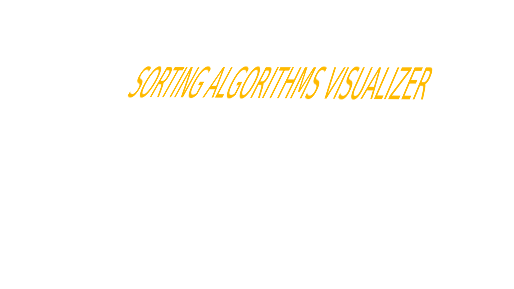

# Table of contents

- [Description](#description)
- [Tech stack](#tech-stack)

## Description

Visualization of sorting algorithms.
Algorithms that are supported:

- [Bubble Sort](https://en.wikipedia.org/wiki/Bubble_sort)
- [Insertion Sort](https://en.wikipedia.org/wiki/Insertion_sort)
- [Selection Sort](https://en.wikipedia.org/wiki/Selection_sort)
- [Quick Sort](https://en.wikipedia.org/wiki/Quicksort)

## Tech stack

Programming languages/libraries that were employed:

- Python
- Pygame
- argparse
